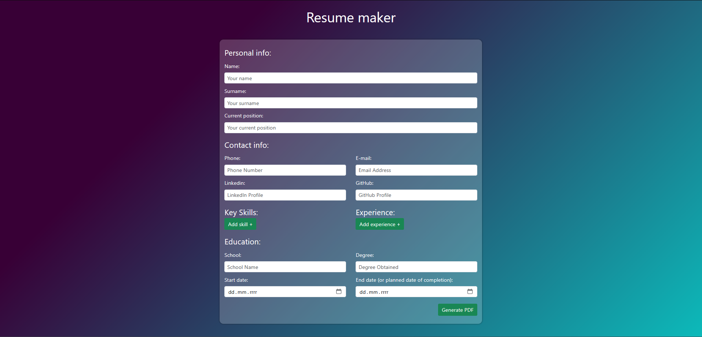

# Resume Maker

The "Resume Maker" project allows users to create simple CVs in PDF format via a form. Users enter their data in the form, and a PDF file with the user's information is generated upon submission.

## Demo

http://jakubpachut.duckdns.org/Resume-maker/

## Features

- A form to fill in personal details, work experience, etc.
- PDF file generation based on the filled-out form.
- Basic PDF attributes (such as title, author, etc.) can be configured in the `.env` file.

## Requirements

- PHP version 7 or later
- Composer version 2.8.5

## How to Run the Project

1. Clone the repository:
    ```bash
    git clone https://github.com/your-repository/Resume-maker.git
    ```

2. Navigate to the project directory:
    ```bash
    cd Resume-maker
    ```

3. Install dependencies:
    ```bash
    composer update
    ```

4. Set PDF attributes in the `.env` file:
    Create a `.env` file in the root of the project and add the following basic attributes:
    ```
    PDF_AUTHOR = 'Your Name'
    PDF_CREATOR = 'Your Creator'
    PDF_TITLE = 'Your Title'
    ```

5. Start the built-in PHP server:
    ```bash
    php -S localhost:8000
    ```

6. Open your browser and navigate to:
    ```
    http://localhost:8000/public
    ```


## Technologies

- PHP
- JavaScript
- Bootstrap
- TCPDF (for PDF generation)
- Object-Oriented Programming (OOP)

## Notes

- The design of the generated PDF is not perfect, as the TCPDF library has limited customization options. If you're looking for better design, you might want to explore other solutions or more advanced libraries.
- This project is mainly for learning purposes and practicing object-oriented programming in PHP and work with pdf file. The focus was on code structure.
